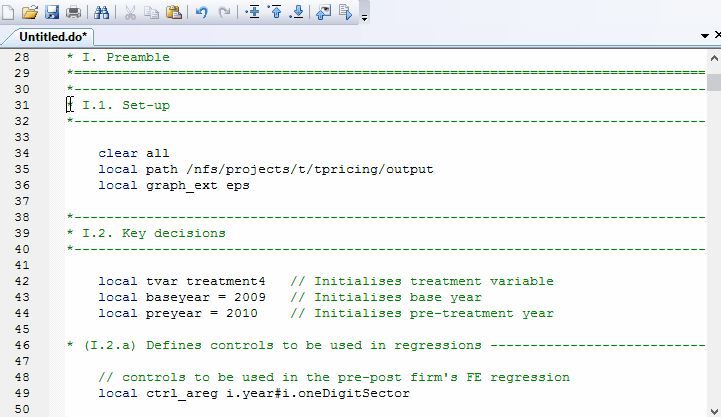

As do-files get larger and more complex, it is common to want to run only a portion or section of the code. Over the years I've come to use extensively what I call **do-switches**, which are just handy devices for "turning on and off" some parts of the code.

# The issue

We've all done it. It starts with

1. Error! `r(XXX);`

  then
  <ol start="2">
    <li>Correct small portion of code</li>
    <li><b>Select section of code in large do-file and run it</b></li>
    <i>(rinse and repeat)</i>
  </ol>

This post is all about step **3.**, which is can be very graphically appreciated in the following gif:



# Enter do-switches

The idea is extremely simple: just set a local to 1 if you want to run some section of the code, and 0 (or anything else) otherwise. Then you can enclose the sections of codes you want to switch "on and off" with conditional blocks.

For example, suppose we have a do-file that imports several datasets and then merges them. We could structure this with the following code:

```
local A     0
local B     0
local merge 0

if `A' == 1 {
  * Import and save A
}

if `B' == 1 {
  * Import and save B
}

if `merge' == 1 {
  * Merge A with B and save
}
```

In that way, if you're only working on importing B, then you can set all switches to 0 except for <code>`B'</code> and then just run the whole do-file without manually selecting a portion of it.
