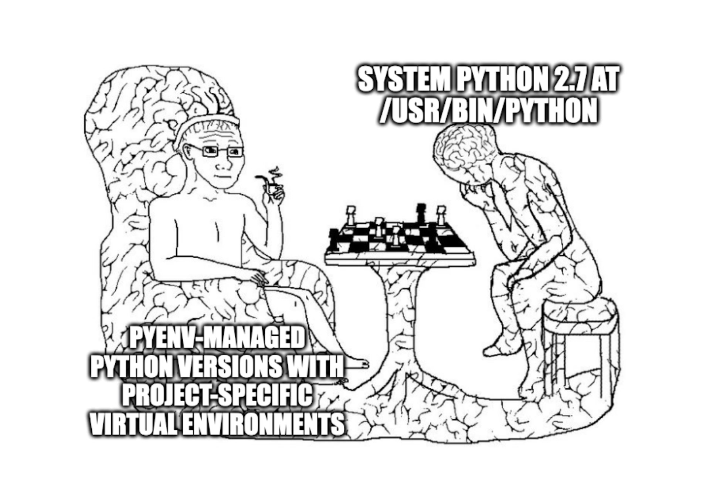

+++
author = "Álvaro Carril"
title = "Python"
date = "2023-06-09"
+++





This is a simple guide to set up Python in macOS / Linux.
The goal is to be able to manage projects that require different Python versions (say, 3.10 vs 3.6), and that have different, potentially conflicting dependencies.

Contrary to the [Zen of Python](https://peps.python.org/pep-0020/), there are a myriad of ways to achieve this very reasonable goal (see [this SO question](https://stackoverflow.com/questions/41573587/what-is-the-difference-between-venv-pyvenv-pyenv-virtualenv-virtualenvwrappe) for instance).
This is _my_ way, which is nevertheless based on much testing and assessment of the pros and cons of each method.


## Getting Python

### Get Homebrew (macOS)

We'll use `pyenv` to install Python, but in order to get `pyenv` itself I suggest using a package manager.
If you're on Linux, I trust you know which package manager you have.
In macOS I always install [Homebrew](https://brew.sh/).

<!-- [Homebrew](https://brew.sh/) is an excellent package manager for macOS. Having it will be helpful for installing many things beyond just Python. -->

1. First you'll need [Xcode](https://developer.apple.com/xcode/). If you don't know what Xcode is that's great, because then you can get away with installing a minimal version. Run
    ```sh
    xcode-select --install
    ```
2. [Installing Homebrew](https://brew.sh/) boils down to running
    ```sh
    /bin/bash -c "$(curl -fsSL https://raw.githubusercontent.com/Homebrew/install/HEAD/install.sh)"
    ```
3. I suggest that right after installing Homebrew, you make sure all package definitions (a.k.a. _formulae_) are up-to-date, which can be done with
    ```sh
    brew update
    ```

### Install `pyenv`

I like using [`pyenv`](https://github.com/pyenv/pyenv) to manage multiple Python versions, as it sticks to the Unix philosophy of doing one thing well.

1. Before installing `pyenv` itself, install its appropriate [Python build dependencies](https://github.com/pyenv/pyenv/wiki#suggested-build-environment). In macOS, run
    ```sh
    brew install openssl readline sqlite3 xz zlib tcl-tk
    ```
2. Then, install `pyenv` with
    ```sh
    brew install pyenv
    ```
<!-- Finally, you need to add `pyenv` to your path so that it runs the appropriate version of Python when using the shell (more details here in step 2 [here](https://github.com/pyenv/pyenv#set-up-your-shell-environment-for-pyenv)). The instructions to correctly set up `pyenv` depend on which shell you're using. -->

### Add `pyenv` to path

The `pyenv` program we just installed needs to be added to the system's path so that it runs the appropriate version of Python whenever we type `python` (more details [here](https://github.com/pyenv/pyenv#set-up-your-shell-environment-for-pyenv)).

1. Find out which shell you're using with
    ```sh
    echo $0
    ```
    
    In macOS you should get either `bash` or `zsh`. Modern macOS versions should have `zsh` (see screenshot below).

    

2. Finally, we'll set up our shell environment for `pyenv`. Assuming your shell is `zsh`, then run
    ```sh
    echo 'export PYENV_ROOT="$HOME/.pyenv"' >> ~/.zshrc
    echo 'command -v pyenv >/dev/null || export PATH="$PYENV_ROOT/bin:$PATH"' >> ~/.zshrc
    echo 'eval "$(pyenv init -)"' >> ~/.zshrc
    ```
    Note: if your shell is `bash`, then replace `~/.zshrc` with `~/.bashrc` in the lines above.


### Install Python with `pyenv`


`pyenv` makes it easy to install any Python version that we want (for example, 3.6.4 or 3.12.0).
Moreover, it contains different Python distributions (for example, Anaconda 3 2022.05).
The full list of available installs can be obtained with
```sh
pyenv install --list
```
You'll get a _long_ list of options.
If you know which version you require (say, for a pre-existing project that contains a `requirements.txt` file), you can install a specific version with `pyenv install <version>`. For example,
```sh
pyenv install 3.10.9    # just an example
```

If you are unsure about which version to install, I'd just go with the most recent one.
The latest available version can be printed out and installed using the two following commands, respectively:
```sh
# print latest version:
pyenv install --list | sed 's/^  //' | grep '^\d' | grep --invert-match 'dev\|a\|b' | tail -1
# install latest version:
pyenv install $(pyenv install --list | sed 's/^  //' | grep '^\d' | grep --invert-match 'dev\|a\|b' | tail -1)
```

Keep in mind that you can always add or remove versions, so this decision is not final.
To uninstall a version, simply use `pyenv uninstall <version>`. See [here](https://github.com/pyenv/pyenv#uninstalling-python-versions) for more info.

### Set up global Python default

Now that Python 3 is installed via `pyenv`, we need to set it as a global (i.e. system default) version.
You can check out the available Python versions in your machine with
```sh
pyenv versions
```


The output I get after running this command in my local machine is above. Notice that there is an asterisk next to `3.8.6`: this indicates it's the active version, which in this case, it's the one I've set up as my global Python version. This can also be obtained by running `pyenv version` (singular).

We can change the global default version by running `pyenv global <version>`, where `<version>` is any of the ones listed when running `pyenv versions`. For example, I can switch my global default version to 3.6.13 by running
```sh
pyenv global 3.6.13
```
I can check that this worked by running `pyenv version` again, or simply by initializing the Python REPL with `python`. See output below.


If you don't need different versions of Python for different projects, having a single global version that is not the system default might be enough for you.
In the next sections we go through setting up projects that utilize different versions and environments.

If you only need one Python version for all your projects, and you'd prefer it wasn't the system default (as you should), then having a single global version should work just fine.
<!-- Up next, we'll walk through how to set up projects that need different Python versions and environments. -->
<!-- 
## Understanding the modern Python setup

This is completely optional, but probably worth knowing. The pyramid below depicts the resolution order for which Python gets used when you call `python` in your terminal.


From bottom to top,
1. **System Python** is the one that comes bundled with macOS, and likely to be version 2.7.something. _You never wnat to use or touch or remove System Python_.
2. 

# References

1. https://opensource.com/article/19/6/python-virtual-environments-mac
2. https://www.freecodecamp.org/news/python-version-on-mac-update/
3. https://stackoverflow.com/questions/29687140/install-latest-python-version-with-pyenv
4. https://stackoverflow.com/questions/41573587/what-is-the-difference-between-venv-pyvenv-pyenv-virtualenv-virtualenvwrappe -->